# Administrative Authentication & Security Foundation (Phase 4)
**Project:** CITYLINE CONSULTANCY  
**Phase:** 4 — Admin Authentication & Security Foundation  
**Authority:** Locked Phase 0 + Phase 1 + Phase 2 + Phase 3  

---

## 1. Authentication Architecture

Phase 4 establishes an enterprise-grade, administrative authentication and authorization subsystem for **CITYLINE CONSULTANCY**. The system is built on the locked 18-table Phase 2 relational schema (`admin_roles`, `admin_users`, `audit_logs`), eliminating the need for arbitrary database alterations while providing rigorous defenses against credential compromise, brute-force attacks, session hijacking, cross-site request forgery, and user enumeration.

### Architectural Core:
- **Authentication Strategy**: Signed, stateless JWT access tokens paired with stateful server-side token revocation and per-request database account verification.
- **Credential Transport**: Browser cookie jar (`HttpOnly`, `SameSite=Lax`, `Secure` in production). Authentication tokens are **never** stored in browser `localStorage`.
- **CSRF Protection**: Double-Submit Cookie defense with constant-time verification for all mutating requests.
- **Timing & Enumeration Defense**: Dummy password evaluation using pre-computed Argon2id hashes when target accounts are not found or inactive.
- **Abuse Prevention**: IP- and identity-based in-memory sliding-window rate limiting with temporary lockouts.
- **Account State Gate**: Instant deactivation propagation (`is_active: false`) verified on every authenticated request.

---

## 2. Password Hashing (Argon2id)

All administrative passwords are protected exclusively using **Argon2id**, the primary password hashing algorithm recommended by OWASP.

### Argon2id Configuration:
- **Variant**: `Argon2id` (v=19, hybrid defense against side-channel and GPU/ASIC attacks)
- **Memory Cost (`m`)**: `19456 KiB` (19 MB)
- **Time Cost (`t`)**: `2 iterations`
- **Parallelism (`p`)**: `1 thread`
- **Salt**: Cryptographically random 16-byte salt generated per hash by the Argon2 driver.
- **Format**: Standard modular crypt format (`$argon2id$v=19$m=19456,t=2,p=1$...`)
- **Constant-Time Verification**: Verification executes via constant-time native comparison.

---

## 3. Password Policy

The administrative password policy enforces high-entropy credentials without arbitrary character composition rules that encourage predictable substitutions:
- **Minimum Length**: `10 characters` (OWASP admin baseline)
- **Maximum Length**: `128 characters` (prevents algorithmic DoS on hash computations)
- **Whitespace Restriction**: Passwords consisting solely of whitespace are rejected.
- **Integrity Guarantee**: Password strings are **never** trimmed, **never** lowercased, and **never** written to logs or audit stores.

---

## 4. Session & Token Architecture

### Token Claims Structure:
```json
{
  "sub": "550e8400-e29b-41d4-a716-446655440000",
  "username": "admin_username",
  "email": "admin@citylineconsultancy.ae",
  "role": "super_admin",
  "roleId": 1,
  "jti": "d6c29b7a-9a99-4d32-9012-7890abcdef01",
  "iat": 1789300000,
  "exp": 1789301800
}
```

### Expiration & Revocation Semantics:
- **Access Token TTL**: Configurable via `AUTH_TOKEN_TTL` (default: `30m` / 1800 seconds).
- **Unique Identifier (`jti`)**: Every issued token receives a cryptographically random UUIDv4.
- **Server-Side Revocation Store**: Revoked `jti` identifiers are tracked in-memory until natural expiration (`exp`), with automatic 5-minute background eviction of expired records.
- **Instant Account Deactivation**: In addition to token signature and revocation checks, `requireAuthenticatedAdmin` queries `admin_users` on every request. If `is_active === false`, authentication is immediately terminated.

---

## 5. Cookie Security

All administrative credentials transported over HTTP adhere to hardened cookie configurations:

| Cookie Name | Purpose | HttpOnly | Secure | SameSite | Path | MaxAge |
| :--- | :--- | :---: | :---: | :---: | :---: | :---: |
| `clc_admin_token` | JWT Access Token | **YES** | **YES** (prod) | **Lax** | `/` | 30 minutes |
| `clc_csrf_token` | Double-Submit CSRF | **NO** | **YES** (prod) | **Lax** | `/` | 30 minutes |

---

## 6. CSRF Protection (Double-Submit Pattern)

To protect state-changing administrative actions without maintaining synchronized session tables:
1. Upon successful login or profile retrieval (`GET /admin/auth/me`), a 32-byte (64-character hex) random token is set in `clc_csrf_token`.
2. Client frontend scripts read this non-HttpOnly cookie and attach its value to mutating requests (`POST`, `PUT`, `PATCH`, `DELETE`) in the `X-CSRF-Token` header.
3. [csrfProtection](file:///d:/VAYUNEX/vayu-backup/CLC-Website/backend/src/middleware/csrf.middleware.ts) middleware verifies that `req.cookies.clc_csrf_token` and `req.headers['x-csrf-token']` match using constant-time comparison (`crypto.timingSafeEqual`).
4. Safe read-only methods (`GET`, `HEAD`, `OPTIONS`) and the initial login endpoint are exempt.

---

## 7. Login Flow (`POST /api/v1/admin/auth/login`)

```mermaid
sequenceDiagram
    participant Client
    participant RateLimiter
    participant AuthController
    participant AdminRepo
    participant Argon2
    participant AuditService

    Client->>RateLimiter: POST /login { identity, password }
    RateLimiter->>RateLimiter: Check IP + Identity failure counts
    alt Rate limit exceeded (>= 5 failures)
        RateLimiter-->>Client: 429 TOO_MANY_REQUESTS (Retry-After)
    else Limit OK
        RateLimiter->>AuthController: Proceed
        AuthController->>AdminRepo: findByIdentity(normalizedIdentity)
        alt Account does not exist
            AuthController->>Argon2: verifyDummyPassword(password)
            AuthController->>RateLimiter: recordFailure(ip, identity)
            AuthController->>AuditService: login_failed (unknown_account)
            AuthController-->>Client: 401 AUTHENTICATION_FAILED (Generic)
        else Account inactive (is_active: false)
            AuthController->>Argon2: verifyDummyPassword(password)
            AuthController->>RateLimiter: recordFailure(ip, identity)
            AuthController->>AuditService: account_disabled_login_attempt
            AuthController-->>Client: 401 AUTHENTICATION_FAILED (Generic)
        else Account active
            AuthController->>Argon2: verifyPassword(password, hash)
            alt Password incorrect
                AuthController->>RateLimiter: recordFailure(ip, identity)
                AuthController->>AuditService: login_failed (wrong_password)
                AuthController-->>Client: 401 AUTHENTICATION_FAILED (Generic)
            else Password valid
                AuthController->>RateLimiter: recordSuccess(ip, identity)
                AuthController->>AdminRepo: updateLastLogin(id)
                AuthController->>AuditService: login_success
                AuthController-->>Client: 200 OK + Set-Cookie (clc_admin_token, clc_csrf_token)
            end
        end
    end
```



---

## 8. Logout Flow (`POST /api/v1/admin/auth/logout`)

1. Request must pass `requireAuthenticatedAdmin` and `csrfProtection`.
2. Token `jti` is submitted to `tokenRevocationStore.revoke()`.
3. Express response issues `clearCookie()` for both `clc_admin_token` and `clc_csrf_token`.
4. Audit log records `action: 'logout'` with `actor_admin_id`.
5. Subsequent requests using the old token receive 401 `AUTHENTICATION_FAILED`.

---

## 9. Role-Based Access Control (RBAC) & IDOR Defense

### Role Hierarchy:
- **`super_admin`**: Full administrative governance, system configuration, audit viewing, document purging, and user management.
- **`admin_operator`**: Operational triage, applicant review, vacancy editing, and assigned lead management.

### Enforcement Guards:
- [requireAuthenticatedAdmin](file:///d:/VAYUNEX/vayu-backup/CLC-Website/backend/src/middleware/auth.middleware.ts#L22): Base guard verifying valid token and active database status.
- [requireRole(...allowedRoles)](file:///d:/VAYUNEX/vayu-backup/CLC-Website/backend/src/middleware/auth.middleware.ts#L80): Role authorization guard returning 403 `FORBIDDEN` and logging `authorization_denied` upon role mismatch.
- [assertAdminResourceAccess(admin, resourceOwnerId)](file:///d:/VAYUNEX/vayu-backup/CLC-Website/backend/src/middleware/auth.middleware.ts#L118): Centralized IDOR guard:
  - `super_admin` possesses universal resource access.
  - `admin_operator` possesses access only to unassigned triage leads (`null`) or leads assigned specifically to their ID.

---

## 10. Rate Limiting & Brute-Force Defense

- **Tracked Keys**:
  - Client IP (`req.ip` / `X-Forwarded-For`)
  - Compound Key: `${clientIp}:${normalizedIdentity}`
- **Threshold**: 5 consecutive failures per 15-minute window (`AUTH_RATE_LIMIT_WINDOW_MS = 900000`).
- **Penalty**: 15-minute temporary lockout (`AUTH_LOCKOUT_DURATION_MS = 900000`).
- **Reset**: Successful login clears failure counters for both the client IP and identity.
- **Anti-DoS Architecture**: Avoids permanent database account locking to prevent distributed denial-of-service against administrators.

---

## 11. Timing & Enumeration Mitigation

1. **Uniform Responses**: Login failures always return HTTP 401 with the exact same error envelope:
   ```json
   {
     "success": false,
     "error": {
       "code": "AUTHENTICATION_FAILED",
       "message": "Invalid credentials.",
       "requestId": "..."
     },
     "timestamp": "..."
   }
   ```
   No differentiation between `"User not found"`, `"Account deactivated"`, and `"Incorrect password"`.
2. **Computational Dummy Hashes**: When an account lookup returns `null` or `is_active: false`, [verifyDummyPassword](file:///d:/VAYUNEX/vayu-backup/CLC-Website/backend/src/auth/password.ts#L107) computes an Argon2id comparison against a pre-computed constant hash, mitigating timing-based account enumeration.

---

## 12. Audit Logging Integration

Security events are written immutably to the Phase 2 `audit_logs` table:
- `login_success`
- `login_failed`
- `logout`
- `account_disabled_login_attempt`
- `authorization_denied`
- `session_invalidated`

**Strict Redaction Policy**:
All audit log details automatically mask `password`, `password_hash`, `token`, `secret`, `cookie`, `authorization`, and `credentials` with `[REDACTED]`.

---

## 13. Environment Configuration Reference

| Variable | Type | Default | Production Rule |
| :--- | :--- | :--- | :--- |
| `AUTH_TOKEN_SECRET` | String | *Dev default* | **Required**, minimum 32 characters, no placeholders |
| `AUTH_TOKEN_TTL` | String | `30m` | Access token duration (e.g., `15m`, `30m`, `1h`) |
| `AUTH_COOKIE_NAME` | String | `clc_admin_token` | Name of HttpOnly authentication cookie |
| `AUTH_CSRF_COOKIE_NAME`| String | `clc_csrf_token` | Name of Double-Submit CSRF cookie |
| `AUTH_RATE_LIMIT_WINDOW_MS` | Number | `900000` (15m) | Sliding rate limit window |
| `AUTH_RATE_LIMIT_MAX_ATTEMPTS` | Number | `5` | Maximum failed attempts before temporary lockout |
| `AUTH_LOCKOUT_DURATION_MS` | Number | `900000` (15m) | Lockout duration in milliseconds |

---

## 14. Testing & Verification Summary

Total Automated Tests: **86 Tests across 15 Suites (100% Pass, 0 Failures)**.

| Suite | Tests | Result | Verification Coverage |
| :--- | :---: | :---: | :--- |
| `auth-password.test.ts` | 7 | **PASS** | Argon2id configuration, salt uniqueness, policy length, timing defense |
| `auth-token.test.ts` | 7 | **PASS** | JWT generation, claim integrity, forged secret rejection, revocation, CSRF |
| `auth-rate-limit.test.ts` | 4 | **PASS** | Sliding window, 5-failure threshold, lockout trigger, success reset, IP isolation |
| `auth-routes.test.ts` | 8 | **PASS** | /login, /logout, /me, enumeration safety, inactive user rejection, cookie flags |
| `auth-rbac.test.ts` | 4 | **PASS** | requireRole super_admin vs operator, assertAdminResourceAccess IDOR |
| `auth-csrf.test.ts` | 5 | **PASS** | Double-submit validation, missing cookie/header rejection, GET exemptions |
| `auth-audit.test.ts` | 2 | **PASS** | audit_logs write, deep credential redaction, transaction rollback propagation |
| `auth-config.test.ts` | 5 | **PASS** | Production fail-fast on missing/short/default AUTH_TOKEN_SECRET |
| *Phase 1-3 Suites* | 44 | **PASS** | Core DB, HTTP, health, repository, security, env config tests |

---

## 15. Known Limitations & Deferred Work

- **Live Remote Database Mapping**: Remote database `cityline_db` access remains `BLOCKED — DATABASE PRIVILEGE REQUIRED` on cPanel. Live migrations/queries will execute once privileges are assigned in cPanel.
- **Self-Registration**: Public administrator self-registration is intentionally disabled.
- **Admin Dashboard UI**: Deferred to **Phase 11** (Admin Dashboard & Management).
- **Password Reset / Email Recovery**: Deferred to a later administrative enhancement.
