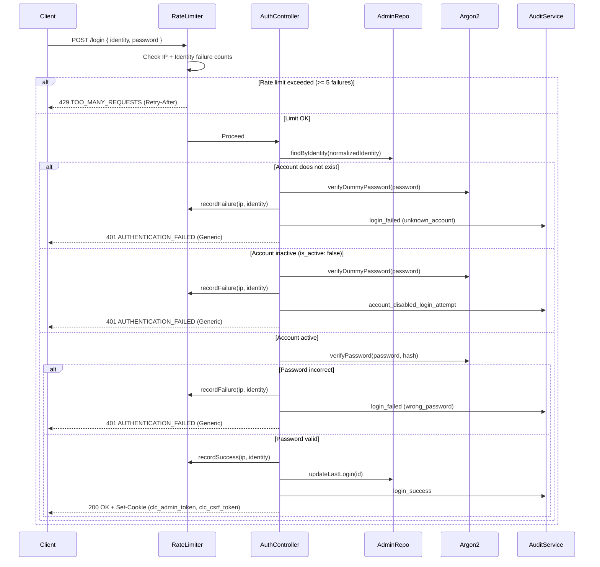

# Administrative Authentication & Security Foundation (Phase 4)
**Project:** CITYLINE CONSULTANCY  
**Phase:** 4 — Admin Authentication & Security Foundation (Hardened Security Pass)  
**Authority:** Locked Phase 0 + Phase 1 + Phase 2 + Phase 3 + Consolidated CTO Security Correction Pass  
**Status:** Production-Oriented Hardened Authentication Foundation  

---

## 1. Authentication Architecture

Phase 4 establishes an enterprise-grade, hardened administrative authentication and authorization subsystem for **CITYLINE CONSULTANCY**. The system provides robust defenses against credential compromise, brute-force attacks, session hijacking, cross-site request forgery, privilege escalation, and user enumeration.

> [!NOTE]
> **Production-Readiness Boundary:**  
> Phase 4 delivers a **production-oriented hardened authentication foundation**. Full production readiness remains subject to cPanel deployment, database privilege mapping, final Passenger connection topology, Phase 14 security audit, Phase 15 QA, Phase 17 deployment, and Phase 18 production verification.

### Core Architectural Pillars:
- **Authentication Strategy**: Signed, stateless JWT access tokens paired with **persistent database-backed token revocation** (`revoked_tokens` table) and per-request active account verification.
- **Credential Transport**: Browser cookie jar (`HttpOnly`, `SameSite=Lax`, `Secure` in production). Authentication tokens are **never** stored in browser `localStorage`.
- **CSRF Protection**: Double-Submit Cookie defense with constant-time verification for all mutating requests (`POST`, `PUT`, `PATCH`, `DELETE`).
- **Timing & Enumeration Defense**: Dummy password evaluation using pre-computed Argon2id hashes when target accounts are non-existent or inactive.
- **Abuse Prevention**: Rate limiting structured behind a replaceable `RateLimitStore` abstraction (runtime memory store with documented multi-process boundaries).
- **Proxy / IP Defense**: Deliberate Express proxy trust configuration (`trust proxy: false` by default) to eliminate client IP spoofing via attacker-supplied forwarding headers.
- **Account State Gate**: Instant deactivation propagation (`is_active: false`) verified against the database on every authenticated request.

---

## 2. Password Hashing (Argon2id)

All administrative passwords are protected exclusively using **Argon2id**, the primary password hashing algorithm recommended by OWASP.

### Argon2id Configuration:
- **Variant**: `Argon2id` (v=19, hybrid defense against side-channel and GPU/ASIC attacks)
- **Memory Cost (`m`)**: `19456 KiB` (19 MB)
- **Time Cost (`t`)**: `2 iterations`
- **Parallelism (`p`)**: `1 thread`
- **Salt**: Cryptographically random 16-byte salt generated per hash by the Argon2 driver.
- **Format**: Standard modular crypt format (`$argon2id$v=19$m=19456,t=2,p=1$...`)
- **Constant-Time Verification**: Verification executes via constant-time native comparison.

---

## 3. Password Policy

The administrative password policy enforces high-entropy credentials without arbitrary character composition rules that encourage predictable substitutions:
- **Minimum Length**: `10 characters` (OWASP admin baseline)
- **Maximum Length**: `128 characters` (prevents algorithmic DoS on hash computations)
- **Whitespace Restriction**: Passwords consisting solely of whitespace are rejected.
- **Integrity Guarantee**: Password strings are **never** trimmed, **never** lowercased, and **never** written to logs or audit stores.

---

## 4. Session & Persistent Token Revocation Architecture

### Token Claims Structure:
```json
{
  "sub": "550e8400-e29b-41d4-a716-446655440000",
  "username": "admin_username",
  "email": "admin@citylineconsultancy.ae",
  "role": "super_admin",
  "roleId": 1,
  "jti": "d6c29b7a-9a99-4d32-9012-7890abcdef01",
  "iat": 1789300000,
  "exp": 1789301800
}
```

### Persistent Revocation Architecture:
In a multi-process Passenger environment or across application restarts, an in-memory process-local revocation store is inadequate because logout on one worker process leaves the token accepted by other workers.

To ensure multi-process consistency and restart survival, token revocation is backed by a dedicated relational table in MariaDB.

#### Schema Extension: `revoked_tokens`
Created via versioned Knex migration `20260913000001_create_revoked_tokens.ts`:
- **`id`**: `BIGINT UNSIGNED AUTO_INCREMENT PRIMARY KEY`
- **`jti`**: `VARCHAR(36) NOT NULL UNIQUE` (Token UUIDv4 identifier)
- **`expires_at`**: `TIMESTAMP NOT NULL` (Natural expiration timestamp of the token)
- **`revoked_at`**: `TIMESTAMP NOT NULL DEFAULT CURRENT_TIMESTAMP`
- **Indexes**:
  - `idx_revoked_tokens_jti`: Fast indexed lookup during authentication checks
  - `idx_revoked_tokens_expires`: Indexed cleanup for bounded purge queries

> [!NOTE]
> **Phase-4 Schema Extension Rationale:**  
> The 18-table relational schema designed in Phase 2 defines the core operational models (`admin_users`, `admin_roles`, `audit_logs`, etc.). `revoked_tokens` is a dedicated Phase-4 security extension required specifically for cross-process session invalidation. `audit_logs` is an immutable security audit ledger and is deliberately **not** misused as a transient token revocation lookup store.

### Revocation Lifecycle:
1. **Login**: A signed JWT is generated containing a unique `jti` and expiration timestamp `exp`. No preliminary rows are inserted into `revoked_tokens`.
2. **Authenticated Request**:
   - The token signature, algorithm, and `exp` claim are verified cryptographically.
   - The token's `jti` is checked against the database: `await tokenRevocationStore.isRevoked(claims.jti)`.
   - If present in `revoked_tokens`, the request is immediately rejected with HTTP 401 `AUTHENTICATION_FAILED`.
   - The administrator's active status is verified in `admin_users`. If `is_active === false`, the request is rejected with HTTP 401.
3. **Logout**:
   - The active administrator context supplies `jti` and `tokenExp`.
   - The server executes `await tokenRevocationStore.revoke(admin.tokenJti, admin.tokenExp)`.
   - The revocation record is committed to the database, ensuring all Node/Passenger processes recognize the revocation.
   - Auth and CSRF cookies are cleared from the client browser.
   - An immutable audit log entry (`action: 'logout'`) is written.
4. **Transactional & Persistence Safety**:
   - If the database write to `revoked_tokens` fails during logout, the controller catches the failure and delegates to centralized error handling.
   - The system **never** falsely reports a successful logout when persistent revocation has failed.
   - Database internal details are suppressed; client receives a safe HTTP 500 error envelope.

### Safe Revocation Cleanup:
Because the JWT cryptographic verification layer automatically rejects expired tokens regardless of revocation state, revocation records whose `expires_at < CURRENT_TIMESTAMP` no longer need to be retained.
- **Bounded Purge**: `purgeExpired()` executes `DELETE FROM revoked_tokens WHERE expires_at < CURRENT_TIMESTAMP`.
- **Performance**: The operation is bounded and accelerated by `idx_revoked_tokens_expires`.
- **Zero High-Frequency Overhead**: Avoids continuous polling; invoked during scheduled maintenance or bounded maintenance jobs.

---

## 5. Rate Limiting & Abuse Prevention

### Architecture & Abstraction:
The authentication rate limiter is decoupled behind a pluggable `RateLimitStore` interface:
```typescript
export interface RateLimitStore {
  get(key: string): Promise<RateLimitRecord | null>;
  increment(key: string, windowMs: number, maxAttempts: number, lockoutMs: number): Promise<RateLimitRecord>;
  reset(key: string): Promise<void>;
}
```

The runtime provides `MemoryRateLimitStore` (in-memory sliding window). The architecture allows drop-in replacement with a shared store (Redis, Memcached, or DB) via `setRateLimitStore()` without modifying authentication controllers.

> [!WARNING]
> **Rate Limiter Process-Local Limitation:**  
> Current development/runtime limiter is process-local. Multi-process/global abuse protection must be validated or upgraded during production deployment/security verification.

### Policy Configuration:
- **Tracked Keys**:
  - Client IP (`req.ip`)
  - Compound Identity Key: `${clientIp}:${normalizedIdentity}`
- **Threshold**: 5 consecutive failures per 15-minute window (`AUTH_RATE_LIMIT_WINDOW_MS = 900000`).
- **Penalty**: 15-minute temporary lockout (`AUTH_LOCKOUT_DURATION_MS = 900000`).
- **Reset**: Successful login resets failure counters for both IP and identity.
- **Anti-DoS**: Avoids permanent account locking in the database to prevent malicious lockout attacks against legitimate administrators.

---

## 6. Client IP & Proxy Trust Handling

When deployed behind web servers, reverse proxies, or Passenger, client IP extraction must not naively trust arbitrary headers:

- **Express Proxy Trust**: The application deliberately configures `app.set('trust proxy', false)` by default.
- **Spoofing Defense**: Client requests supplying fabricated `X-Forwarded-For` headers cannot bypass IP-based rate limiting or poison security logs. The socket address (`req.ip`) is authoritative under untrusted proxy settings.
- **cPanel Reverse Proxy Status**: Marked **UNVERIFIED**.
  > [!NOTE]
  > The exact cPanel Passenger/Apache reverse-proxy topology cannot be verified until staging deployment. Blindly enabling `trust proxy: true` is prohibited because it allows clients to spoof arbitrary IPs. In Phase 17, proxy trust will be calibrated to the specific loopback/trusted proxy hop once the network topology is confirmed.

---

## 7. Cookie Security & CSRF Defense

All administrative credentials transported over HTTP adhere to hardened cookie configurations:

| Cookie Name | Purpose | HttpOnly | Secure | SameSite | Path | MaxAge |
| :--- | :--- | :---: | :---: | :---: | :---: | :---: |
| `clc_admin_token` | JWT Access Token | **YES** | **YES** (prod) | **Lax** | `/` | 30 minutes |
| `clc_csrf_token` | Double-Submit CSRF | **NO** | **YES** (prod) | **Lax** | `/` | 30 minutes |

### CSRF Protection (Double-Submit Pattern):
1. Upon successful login or profile check (`GET /admin/auth/me`), a 32-byte (64-character hex) random token is issued in `clc_csrf_token`.
2. Client frontend scripts read this non-HttpOnly cookie and attach its value to mutating requests (`POST`, `PUT`, `PATCH`, `DELETE`) in the `X-CSRF-Token` header.
3. [csrfProtection](file:///d:/VAYUNEX/vayu-backup/CLC-Website/backend/src/middleware/csrf.middleware.ts) middleware verifies that `req.cookies.clc_csrf_token` and `req.headers['x-csrf-token']` match using constant-time comparison (`crypto.timingSafeEqual`).
4. Safe read-only methods (`GET`, `HEAD`, `OPTIONS`) and the initial login endpoint are exempt.

---

## 8. Login & Authentication Flow



---

## 9. Role-Based Access Control (RBAC) & IDOR Defense

### Role Hierarchy:
- **`super_admin`**: Full administrative governance, system configuration, audit viewing, document purging, and user management.
- **`admin_operator`**: Operational triage, applicant review, vacancy editing, and assigned lead management.

### Enforcement Guards:
- [requireAuthenticatedAdmin](file:///d:/VAYUNEX/vayu-backup/CLC-Website/backend/src/middleware/auth.middleware.ts#L22): Base guard verifying valid signature, non-revocation in DB, and active status in DB.
- [requireRole(...allowedRoles)](file:///d:/VAYUNEX/vayu-backup/CLC-Website/backend/src/middleware/auth.middleware.ts#L80): Role authorization guard returning 403 `FORBIDDEN` and logging `authorization_denied` upon role mismatch.
- [assertAdminResourceAccess(admin, resourceOwnerId)](file:///d:/VAYUNEX/vayu-backup/CLC-Website/backend/src/middleware/auth.middleware.ts#L118): Centralized IDOR guard:
  - `super_admin` possesses universal resource access.
  - `admin_operator` possesses access only to unassigned triage leads (`null`) or leads assigned specifically to their ID.

---

## 10. Timing & Enumeration Mitigation

1. **Uniform Responses**: Login failures always return HTTP 401 with the exact same error envelope:
   ```json
   {
     "success": false,
     "error": {
       "code": "AUTHENTICATION_FAILED",
       "message": "Invalid credentials.",
       "requestId": "..."
     },
     "timestamp": "..."
   }
   ```
   No differentiation between `"User not found"`, `"Account deactivated"`, and `"Incorrect password"`.
2. **Computational Dummy Hashes**: When an account lookup returns `null` or `is_active: false`, [verifyDummyPassword](file:///d:/VAYUNEX/vayu-backup/CLC-Website/backend/src/auth/password.ts#L107) computes an Argon2id comparison against a pre-computed constant hash, mitigating timing-based account enumeration.

---

## 11. Audit Logging Integration

Security events are written immutably to the Phase 2 `audit_logs` table:
- `login_success`
- `login_failed`
- `logout`
- `account_disabled_login_attempt`
- `authorization_denied`
- `session_invalidated`

**Strict Redaction Policy**:
All audit log details automatically mask `password`, `password_hash`, `token`, `secret`, `cookie`, `authorization`, and `credentials` with `[REDACTED]`.

---

## 12. Environment Configuration Reference

| Variable | Type | Default | Production Rule |
| :--- | :--- | :--- | :--- |
| `AUTH_TOKEN_SECRET` | String | *Dev default* | **Required**, non-default secret (minimum 32 characters) |
| `AUTH_TOKEN_TTL` | String | `30m` | Access token duration (e.g., `15m`, `30m`, `1h`) |
| `AUTH_COOKIE_NAME` | String | `clc_admin_token` | Name of HttpOnly authentication cookie |
| `AUTH_CSRF_COOKIE_NAME`| String | `clc_csrf_token` | Name of Double-Submit CSRF cookie |
| `AUTH_RATE_LIMIT_WINDOW_MS` | Number | `900000` (15m) | Sliding rate limit window |
| `AUTH_RATE_LIMIT_MAX_ATTEMPTS` | Number | `5` | Maximum failed attempts before temporary lockout |
| `AUTH_LOCKOUT_DURATION_MS` | Number | `900000` (15m) | Lockout duration in milliseconds |

> [!NOTE]
> **Authentication Secret Language:**  
> Production requires a sufficiently long, non-default secret (minimum 32 characters). A minimum character length validation ensures sufficient key space, but cryptographic entropy depends on generating keys using a cryptographically secure pseudorandom number generator (CSPRNG). Never claim 32-character entropy based purely on string length.

---

## 13. Testing & Verification Summary

Total Automated Tests: **96 Tests across 16 Suites (100% Pass, 0 Failures)**.

| Suite | Tests | Result | Verification Coverage |
| :--- | :---: | :---: | :--- |
| `auth-revocation-persistent.test.ts` | 10 | **PASS** | Persistent DB revocation, survival across connections/restarts, jti indexing, cleanup, failed write propagation |
| `auth-password.test.ts` | 7 | **PASS** | Argon2id configuration, salt uniqueness, policy length, timing defense |
| `auth-token.test.ts` | 6 | **PASS** | JWT generation, claim integrity, forged secret rejection, CSRF tokens |
| `auth-rate-limit.test.ts` | 5 | **PASS** | Sliding window, 5-failure threshold, lockout trigger, success reset, IP isolation, proxy spoofing defense |
| `auth-routes.test.ts` | 8 | **PASS** | /login, /logout, /me, enumeration safety, inactive user rejection, cookie flags |
| `auth-rbac.test.ts` | 4 | **PASS** | requireRole super_admin vs operator, assertAdminResourceAccess IDOR |
| `auth-csrf.test.ts` | 5 | **PASS** | Double-submit validation, missing cookie/header rejection, GET exemptions |
| `auth-audit.test.ts` | 2 | **PASS** | audit_logs write, deep credential redaction, transaction rollback propagation |
| `auth-config.test.ts` | 5 | **PASS** | Production fail-fast on missing/short/default AUTH_TOKEN_SECRET |
| *Phase 1-3 Suites* | 44 | **PASS** | Core DB, HTTP, health, repository, security, env config tests |

---

## 14. Known Limitations & Deferred Work

- **Live Remote Database Mapping**: Remote database `cityline_db` access remains `BLOCKED — DATABASE PRIVILEGE REQUIRED` on cPanel. Live migrations/queries will execute once privileges are assigned in cPanel.
- **Admin Dashboard UI**: Deferred to **Phase 11** (Admin Dashboard & Management).
- **Public Website & Forms**: Deferred to **Phase 5** (Public Website Implementation).
- **Visa Enquiry & Documents**: Deferred to **Phase 6** (Visa Enquiry + Document Upload System).
- **SMTP Notification System**: Deferred to **Phase 7** (SMTP Notification System).
- **Multi-Process Shared Rate Limiter**: Structured behind `RateLimitStore`; production shared store evaluation deferred to Phase 14 / Phase 17.
