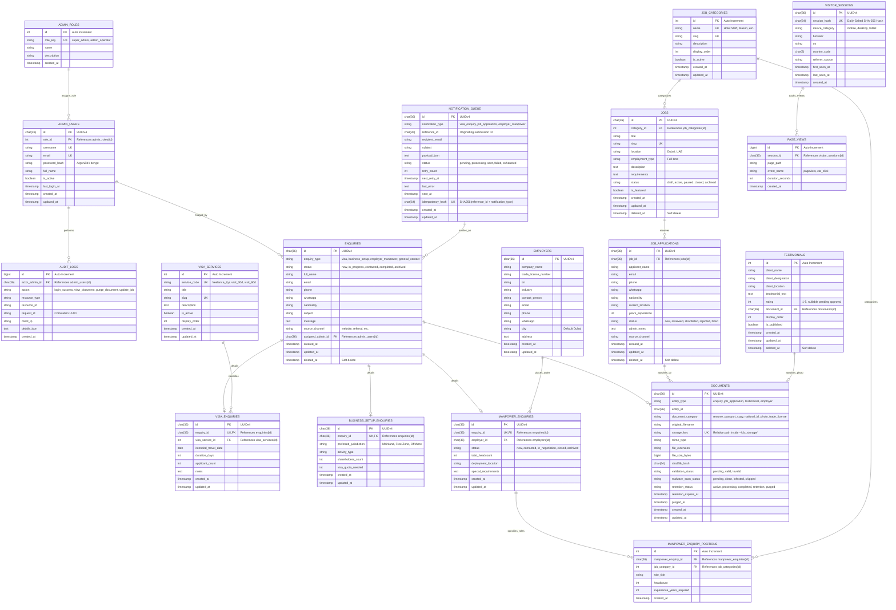

# CITYLINE CONSULTANCY — Database Entity-Relationship Diagram (ERD)

**Document Version:** 2.0.0  
**Phase Status:** Phase 2 Complete  
**Public Brand Name:** `CITYLINE CONSULTANCY`

---

```mermaid
erDiagram
    ADMIN_ROLES ||--o{ ADMIN_USERS : assigns_role
    ADMIN_USERS ||--o{ AUDIT_LOGS : performs
    ADMIN_USERS ||--o{ ENQUIRIES : triaged_by
    
    ENQUIRIES ||--o| VISA_ENQUIRIES : details
    ENQUIRIES ||--o| BUSINESS_SETUP_ENQUIRIES : details
    ENQUIRIES ||--o| MANPOWER_ENQUIRIES : details
    
    VISA_SERVICES ||--o{ VISA_ENQUIRIES : classifies
    
    EMPLOYERS ||--o{ MANPOWER_ENQUIRIES : places_order
    MANPOWER_ENQUIRIES ||--o{ MANPOWER_ENQUIRY_POSITIONS : specifies_roles
    JOB_CATEGORIES ||--o{ MANPOWER_ENQUIRY_POSITIONS : categorizes
    
    JOB_CATEGORIES ||--o{ JOBS : categorizes
    JOBS ||--o{ JOB_APPLICATIONS : receives
    
    ENQUIRIES ||--o{ DOCUMENTS : references
    JOB_APPLICATIONS ||--o{ DOCUMENTS : attaches_cv
    TESTIMONIALS ||--o| DOCUMENTS : attaches_photo
    
    NOTIFICATION_QUEUE ||--o{ ENQUIRIES : notifies_on
    
    VISITOR_SESSIONS ||--o{ PAGE_VIEWS : tracks_events

    ADMIN_ROLES {
        int id PK "Auto Increment"
        string role_key UK "super_admin, admin_operator"
        string name
        string description
        timestamp created_at
    }

    ADMIN_USERS {
        char(36) id PK "UUIDv4"
        int role_id FK "References admin_roles(id)"
        string username UK
        string email UK
        string password_hash "Argon2id / bcrypt"
        string full_name
        boolean is_active
        timestamp last_login_at
        timestamp created_at
        timestamp updated_at
    }

    JOB_CATEGORIES {
        int id PK "Auto Increment"
        string name UK "Hotel Staff, Mason, etc."
        string slug UK
        string description
        int display_order
        boolean is_active
        timestamp created_at
        timestamp updated_at
    }

    VISA_SERVICES {
        int id PK "Auto Increment"
        string service_code UK "freelance_2yr, visit_30d, visit_60d"
        string title
        string slug UK
        text description
        boolean is_active
        int display_order
        timestamp created_at
        timestamp updated_at
    }

    ENQUIRIES {
        char(36) id PK "UUIDv4"
        string enquiry_type "visa, business_setup, employer_manpower, general_contact"
        string status "new, in_progress, contacted, completed, archived"
        string full_name
        string email
        string phone
        string whatsapp
        string nationality
        string subject
        text message
        string source_channel "website, referral, etc."
        char(36) assigned_admin_id FK "References admin_users(id)"
        timestamp created_at
        timestamp updated_at
        timestamp deleted_at "Soft delete"
    }

    VISA_ENQUIRIES {
        char(36) id PK "UUIDv4"
        char(36) enquiry_id UK,FK "References enquiries(id)"
        int visa_service_id FK "References visa_services(id)"
        date intended_travel_date
        int duration_days
        int applicant_count
        text notes
        timestamp created_at
        timestamp updated_at
    }

    BUSINESS_SETUP_ENQUIRIES {
        char(36) id PK "UUIDv4"
        char(36) enquiry_id UK,FK "References enquiries(id)"
        string preferred_jurisdiction "Mainland, Free Zone, Offshore"
        string activity_type
        int shareholders_count
        int visa_quota_needed
        timestamp created_at
        timestamp updated_at
    }

    EMPLOYERS {
        char(36) id PK "UUIDv4"
        string company_name
        string trade_license_number
        string trn
        string industry
        string contact_person
        string email
        string phone
        string whatsapp
        string city "Default Dubai"
        text address
        timestamp created_at
        timestamp updated_at
    }

    MANPOWER_ENQUIRIES {
        char(36) id PK "UUIDv4"
        char(36) enquiry_id UK,FK "References enquiries(id)"
        char(36) employer_id FK "References employers(id)"
        string status "new, contacted, in_negotiation, closed, archived"
        int total_headcount
        string deployment_location
        text special_requirements
        timestamp created_at
        timestamp updated_at
    }

    MANPOWER_ENQUIRY_POSITIONS {
        int id PK "Auto Increment"
        char(36) manpower_enquiry_id FK "References manpower_enquiries(id)"
        int job_category_id FK "References job_categories(id)"
        string role_title
        int headcount
        int experience_years_required
        timestamp created_at
    }

    JOBS {
        char(36) id PK "UUIDv4"
        int category_id FK "References job_categories(id)"
        string title
        string slug UK
        string location "Dubai, UAE"
        string employment_type "Full-time"
        text description
        text requirements
        string status "draft, active, paused, closed, archived"
        boolean is_featured
        timestamp created_at
        timestamp updated_at
        timestamp deleted_at "Soft delete"
    }

    JOB_APPLICATIONS {
        char(36) id PK "UUIDv4"
        char(36) job_id FK "References jobs(id)"
        string applicant_name
        string email
        string phone
        string whatsapp
        string nationality
        string current_location
        int years_experience
        string status "new, reviewed, shortlisted, rejected, hired"
        text admin_notes
        string source_channel
        timestamp created_at
        timestamp updated_at
        timestamp deleted_at "Soft delete"
    }

    DOCUMENTS {
        char(36) id PK "UUIDv4"
        string entity_type "enquiry, job_application, testimonial, employer"
        char(36) entity_id
        string document_category "resume, passport_copy, national_id, photo, trade_license"
        string original_filename
        string storage_key UK "Relative path inside ~/clc_storage/"
        string mime_type
        string file_extension
        bigint file_size_bytes
        char(64) sha256_hash
        string validation_status "pending, valid, invalid"
        string malware_scan_status "pending, clean, infected, skipped"
        string retention_status "active, processing, completed, retention, purged"
        timestamp retention_expires_at
        timestamp purged_at
        timestamp created_at
        timestamp updated_at
    }

    TESTIMONIALS {
        int id PK "Auto Increment"
        string client_name
        string client_designation
        string client_location
        text testimonial_text
        int rating "1-5, nullable pending approval"
        char(36) document_id FK "References documents(id)"
        int display_order
        boolean is_published
        timestamp created_at
        timestamp updated_at
        timestamp deleted_at "Soft delete"
    }

    NOTIFICATION_QUEUE {
        char(36) id PK "UUIDv4"
        string notification_type "visa_enquiry, job_application, employer_manpower"
        char(36) reference_id "Originating submission ID"
        string recipient_email
        string subject
        text payload_json
        string status "pending, processing, sent, failed, exhausted"
        int retry_count
        timestamp next_retry_at
        text last_error
        timestamp sent_at
        char(64) idempotency_hash UK "SHA256(reference_id + notification_type)"
        timestamp created_at
        timestamp updated_at
    }

    VISITOR_SESSIONS {
        char(36) id PK "UUIDv4"
        char(64) session_hash UK "Daily-Salted SHA-256 Hash"
        string device_category "mobile, desktop, tablet"
        string browser
        string os
        char(2) country_code
        string referrer_source
        timestamp first_seen_at
        timestamp last_seen_at
        timestamp created_at
    }

    PAGE_VIEWS {
        bigint id PK "Auto Increment"
        char(36) session_id FK "References visitor_sessions(id)"
        string page_path
        string event_name "pageview, cta_click"
        int duration_seconds
        timestamp created_at
    }

    AUDIT_LOGS {
        bigint id PK "Auto Increment"
        char(36) actor_admin_id FK "References admin_users(id)"
        string action "login_success, view_document, purge_document, update_job"
        string resource_type
        string resource_id
        string request_id "Correlation UUID"
        string client_ip
        text details_json
        timestamp created_at
    }
```
