# CITYLINE CONSULTANCY — Domain Model & Database Architecture

> **Document Status**: Confirmed Baseline  
> **Phase**: Phase 0 — Foundation, Discovery & Scope Lock  
> **Target Database Engine**: Relational Database Engine (OPEN / UNVERIFIED pending cPanel host inspection; Baseline Charset: `utf8mb4`)  
> **Rule**: Architectural domain model for Phase 2 implementation. **Zero migrations to be run in Phase 0**.

---

## 1. Domain Entity Relationship Diagram

```mermaid
erDiagram
    ADMIN_USERS ||--o{ AUDIT_LOGS : performs
    SERVICES ||--o{ ENQUIRIES : categorized_under
    VISA_SERVICES ||--o{ ENQUIRIES : references
    ENQUIRIES ||--o{ ENQUIRY_DOCUMENTS : contains
    JOB_CATEGORIES ||--o{ JOBS : categorizes
    JOBS ||--o{ JOB_APPLICATIONS : receives
    JOB_APPLICATIONS ||--o{ APPLICATION_DOCUMENTS : attaches
    VISITOR_SESSIONS ||--o{ PAGE_VIEWS : logs
    
    ADMIN_USERS {
        char(36) id PK "UUID"
        varchar(100) username UK
        varchar(255) email UK
        varchar(255) password_hash
        varchar(50) role "super_admin, admin_operator"
        tinyint is_active
        datetime last_login_at
        datetime created_at
        datetime updated_at
    }

    JOB_CATEGORIES {
        int id PK "Auto Increment"
        varchar(100) name UK
        varchar(100) slug UK
        varchar(255) description
        int display_order
        tinyint is_active
        datetime created_at
        datetime updated_at
    }

    JOBS {
        char(36) id PK "UUID"
        int category_id FK
        varchar(255) title
        varchar(255) slug UK
        varchar(100) employment_type
        varchar(100) location
        text description
        text requirements
        varchar(50) status "active, paused, closed"
        tinyint is_featured
        datetime created_at
        datetime updated_at
        datetime deleted_at "Soft delete"
    }

    JOB_APPLICATIONS {
        char(36) id PK "UUID"
        char(36) job_id FK
        varchar(150) applicant_name
        varchar(255) email
        varchar(50) phone
        varchar(100) nationality
        varchar(100) current_location
        int years_experience
        varchar(50) status "new, reviewed, shortlisted, rejected, hired"
        text admin_notes
        datetime created_at
        datetime updated_at
        datetime deleted_at "Soft delete"
    }

    APPLICATION_DOCUMENTS {
        char(36) id PK "UUID"
        char(36) application_id FK
        varchar(100) document_type "resume"
        varchar(255) original_filename
        varchar(255) stored_filename
        varchar(50) mime_type
        bigint file_size_bytes
        varchar(500) storage_path
        varchar(50) retention_status "active, archived, purged"
        datetime purged_at
        datetime created_at
    }

    ENQUIRIES {
        char(36) id PK "UUID"
        varchar(50) enquiry_type "visa, business_setup, general_contact"
        varchar(100) service_reference "freelance_2yr, visit_30d, visit_60d, etc."
        varchar(150) full_name
        varchar(255) email
        varchar(50) phone
        varchar(100) nationality
        text message
        varchar(50) status "new, in_progress, contacted, completed, archived"
        text admin_notes
        datetime created_at
        datetime updated_at
        datetime deleted_at "Soft delete"
    }

    ENQUIRY_DOCUMENTS {
        char(36) id PK "UUID"
        char(36) enquiry_id FK
        varchar(100) document_category "passport_copy, photo, national_id, other"
        varchar(255) original_filename
        varchar(255) stored_filename
        varchar(50) mime_type
        bigint file_size_bytes
        varchar(500) storage_path
        varchar(50) retention_status "active, archived, purged"
        datetime purged_at
        datetime created_at
    }

    EMPLOYER_ENQUIRIES {
        char(36) id PK "UUID"
        varchar(255) company_name
        varchar(150) contact_person
        varchar(255) email
        varchar(50) phone
        varchar(100) industry
        varchar(150) required_role
        int headcount_needed
        varchar(100) deployment_location
        text requirements_details
        varchar(50) status "new, contacted, in_negotiation, closed, archived"
        text admin_notes
        datetime created_at
        datetime updated_at
    }

    TESTIMONIALS {
        int id PK "Auto Increment"
        varchar(150) author_name
        varchar(150) author_designation
        varchar(150) author_location
        text content
        int rating "1-5, nullable pending approval"
        varchar(255) photo_url "Optional local path"
        int display_order
        tinyint is_published
        datetime created_at
        datetime updated_at
    }

    NOTIFICATION_QUEUE {
        char(36) id PK "UUID"
        varchar(50) notification_type "visa_enquiry, job_app, employer_req, contact"
        char(36) reference_id "Related submission ID"
        varchar(255) recipient_email
        varchar(255) subject
        varchar(50) status "pending, processing, sent, failed, exhausted"
        int retry_count
        datetime next_retry_at
        text last_error
        datetime sent_at
        varchar(64) idempotency_hash UK
        datetime created_at
        datetime updated_at
    }

    VISITOR_SESSIONS {
        char(36) id PK "UUID"
        char(16) session_hash UK "Daily Salted Pseudonymous SHA-256 Hash"
        varchar(100) device_type "mobile, desktop, tablet"
        varchar(100) browser
        varchar(100) os
        varchar(100) country_code
        varchar(255) referrer_source
        datetime first_seen_at
        datetime last_seen_at
    }

    PAGE_VIEWS {
        bigint id PK "Auto Increment"
        char(36) session_id FK
        varchar(255) page_path
        varchar(100) event_name "pageview, cta_click, form_start, form_complete"
        int duration_seconds
        datetime created_at
    }

    AUDIT_LOGS {
        bigint id PK "Auto Increment"
        char(36) admin_user_id FK
        varchar(100) action "login, view_doc, download_doc, purge_doc, delete_record"
        varchar(100) resource_type
        char(36) resource_id
        varchar(45) client_ip
        text details_json
        datetime created_at
    }
```

---

## 2. Core Entities & Lifecycle Specifications

### 2.1. Administrative Users (`admin_users`) & RBAC
- **Purpose**: Back-office operators managing inquiries, vacancies, and records.
- **RBAC Roles**: `super_admin` (system governance, purge authority, admin provisioning) and `admin_operator` (lead triage, job editing, document viewing).
- **Security Flag**: `is_active` boolean allows instant account suspension without row deletion.

### 2.2. Job Categories (`job_categories`)
- **Purpose**: Dynamic classification for job postings, resolving the extensibility requirement.
- **Initial Seed Values**: Hotel Staff, Cleaning, Mason, Steel Fixer, Carpenter, Bike Rider / Delivery Job, Taxi Driver, Truck Driver.
- **Attributes**: `slug` (indexed for URL routing), `display_order` (controls presentation sequence).

### 2.3. Job Postings (`jobs`)
- **Purpose**: Career opportunities advertised on the public job board.
- **Lifecycle**: `draft` -> `active` -> `paused` -> `closed` -> `archived`.
- **Soft Delete**: `deleted_at` timestamp ensures historical job applications retain relational links even if a job posting is archived.

### 2.4. Job Applications (`job_applications`) & Documents (`application_documents`)
- **Purpose**: Candidate applications linked to open jobs.
- **Triage Lifecycle**: `new` -> `reviewed` -> `shortlisted` -> `rejected` -> `hired`.
- **Document Retention Fields**: `retention_status` (`active`, `archived`, `purged`) and `purged_at` track document retention lifecycle without losing candidate record continuity.

### 2.5. Enquiries (`enquiries`) & Documents (`enquiry_documents`)
- **Purpose**: Ingestion of Visa, Business Setup, and General Contact leads.
- **Polymorphic Reference**: `enquiry_type` distinguishes between `visa`, `business_setup`, and `general_contact`.
- **Configurable Document Architecture**: Supports 0 to N uploaded documents per enquiry. Each document record specifies `document_category` (e.g., `passport_copy`, `photo`, `entry_stamp`), allowing runtime flexibility without schema changes.
- **Document Retention Fields**: `retention_status` (`active`, `archived`, `purged`) and `purged_at` record physical file deletion.

### 2.6. Employer Requisitions (`employer_enquiries`)
- **Purpose**: Dedicated B2B manpower requisitions from UAE corporate clients.
- **Lifecycle**: `new` -> `contacted` -> `in_negotiation` -> `closed`.

### 2.7. Testimonials (`testimonials`)
- **Purpose**: Social proof curation for the public site.
- **Controls**: `is_published` toggle, `display_order` priority, optional `rating` (nullable pending business sign-off).

### 2.8. Resilient Database-First Notification Queue (`notification_queue`)
- **Purpose**: Decoupled notification dispatch ensuring that email delivery failures never compromise database integrity.
- **Fields**:
  - `status`: `pending`, `processing`, `sent`, `failed`, `exhausted`.
  - `retry_count`: Incremented per failed attempt.
  - `next_retry_at`: Managed via exponential backoff (e.g., 2m, 10m, 30m, 1h).
  - `idempotency_hash`: `SHA256(reference_id + notification_type)` preventing duplicate emails.
  - `last_error`: Diagnostic payload from SMTP gateway.

### 2.9. Privacy-Preserving Analytics (`visitor_sessions`, `page_views`)
- **Purpose**: First-party analytics collection without persistent tracking cookies or PII exposure.
- **Pseudonymous Processing**: `session_hash` is a daily-salted SHA-256 hash representing a pseudonymous session, not an anonymous identifier.
- **Indexing**: Indexed on `created_at` and `page_path` for rapid aggregation of daily metrics.

### 2.10. Append-Oriented Administrative Audit Log (`audit_logs`)
- **Purpose**: Track all sensitive operational events (login, document viewing, document purging, job changes).
- **Tamper Protection**: Insert-only table with no application-level update or delete capabilities.

---

## 3. Indexing & Optimization Strategy

| Table | Target Columns | Index Type | Optimization Objective |
| :--- | :--- | :--- | :--- |
| `jobs` | `(status, is_featured, created_at)` | Composite Index | Instant filtering of active jobs on public board. |
| `jobs` | `slug` | Unique Index | Fast slug-based route resolution (`/jobs/:slug`). |
| `enquiries` | `(enquiry_type, status, created_at)` | Composite Index | High-speed triage queries in Admin Panel. |
| `job_applications` | `(job_id, status, created_at)` | Composite Index | Rapid candidate filtering per job. |
| `enquiry_documents` | `enquiry_id` | Foreign Key Index | Fast retrieval of attachments during admin document review. |
| `notification_queue` | `(status, next_retry_at)` | Composite Index | High-performance polling for the cron dispatcher worker. |
| `visitor_sessions` | `session_hash` | Unique Index | Rapid deduplication of unique daily visits. |
| `page_views` | `(page_path, created_at)` | Composite Index | Aggregation of top viewed pages over time windows. |
